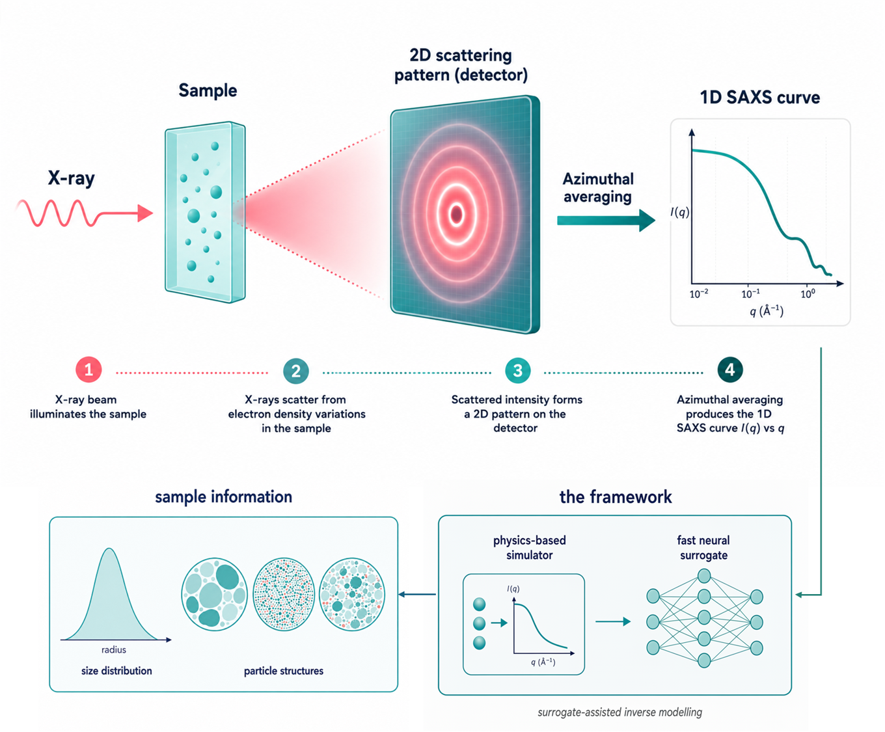
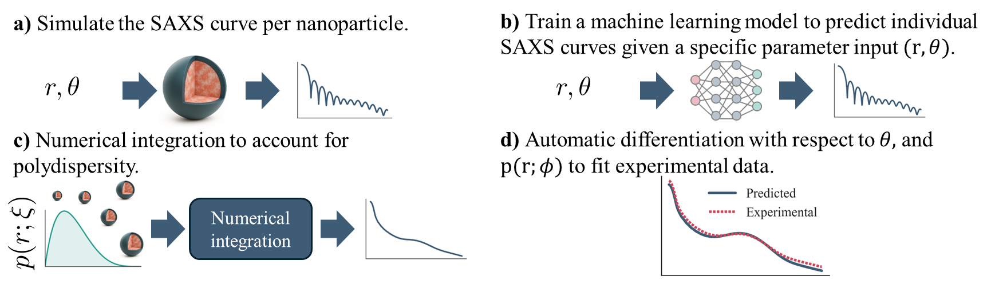
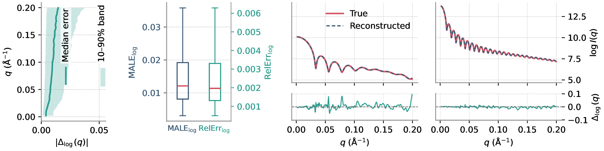
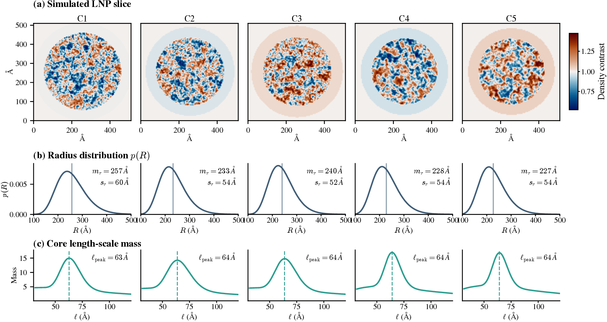

# AI-SAXS


A differentiable framework for fitting one-dimensional SAXS curves of
polydisperse nanoparticles, including systems with heterogeneous interior
structure (such as lipid nanoparticles) where standard analytical models
do not apply.

<p align="center">
  
</p>

<p align="center"><em>A SAXS experiment measures a 1D scattering curve from a nanoparticle sample (top). The framework runs this in reverse (bottom): a neural surrogate of the physics-based simulator maps the measured curve back to sample information, such as the size distribution and interior structure of the particles.</em></p>

## Start here

Different ways into this repo, depending on what you want:

| If you want to... | Open this |
|---|---|
| Understand the framework without running code | [Project documentation site](https://mariabankestad.github.io/aisaxs/) |
| Fit a homogeneous-particle SAXS curve (sphere or core-shell) | [`notebooks/tutorial_analytical_sphere_gold.ipynb`](notebooks/tutorial_analytical_sphere_gold.ipynb) |
| Fit a heterogeneous-interior SAXS curve (LNP-style) | [`fit_experimental_curve.py`](fit_experimental_curve.py) |
| Understand the LNP physical simulator | [`notebooks/tutorial_simulation_model.ipynb`](notebooks/tutorial_simulation_model.ipynb) |
| See the neural surrogate in isolation | [`notebooks/tutorial_ml_surrogate.ipynb`](notebooks/tutorial_ml_surrogate.ipynb) |
| Retrain the surrogate from scratch | [`train_predictor.py`](train_predictor.py) |

## Why

For homogeneous nanoparticles like gold particles, fitting a SAXS curve
with an analytical sphere or core-shell form factor works well. For
heterogeneous, polydisperse particles like lipid nanoparticles (LNPs),
analytical forms do not capture the stochastic interior structure, and the
realistic numerical models that do are far too slow to embed in a fitting
loop. Even when a fit converges, the SAXS inverse problem is non-unique:
many different parameter sets can produce essentially the same one-dimensional
SAXS profile.

The framework addresses both problems. A neural surrogate of the physical
forward model makes fitting fast enough that large-scale multi-start
optimisation is practical. Rather than reporting a single best-fit parameter set, the
framework retains an ensemble of near-optimal solutions and characterises
which parameter directions the data constrains and which remain degenerate.

## What you get

Given a one-dimensional SAXS curve from polydisperse nanoparticles in
solution, the framework returns:

- A best-fit set of structural and size-distribution parameters
  (mean radius, polydispersity, shell thickness, interior length scales).
- An **ensemble of near-optimal solutions**, not just a single best fit.
- A visual answer to the question *"which of those parameters is actually
  constrained by my data?"*, shown by retaining solutions that fit the
  curve equally well but correspond to different real-space morphologies
  (see [What it can't resolve](#what-it-cant-resolve)).

This is complementary to DLS (which reports only a hydrodynamic radius)
and cryo-TEM (which images single particles in vitrified ice but does
not represent the solution-state population).

## How it works

Three pieces fit together. A JAX physical simulator generates SAXS
curves from a stochastic interior model. A neural surrogate, trained on
those simulations, evaluates the forward prediction roughly four orders
of magnitude faster. A multi-start gradient-based fitter uses the
surrogate to match a measured curve. The retained low-loss restarts
then feed the identifiability analysis.

<p align="center">
  
</p>

## How accurate is the surrogate?

On the held-out test set, the surrogate matches the JAX simulator to
within a small fraction of the noise on a real measurement. The left
panels show the error distribution across the test set; the right two
panels show example predictions overlaid on the reference simulation,
with residuals underneath.

<p align="center">
  
</p>

## What it can't resolve

SAXS is an inverse problem: different real-space morphologies can
produce nearly identical one-dimensional scattering profiles. Rather
than hiding this, the framework retains an ensemble of near-optimal
solutions and makes the non-uniqueness directly visible. The figure
shows several restarts that fit the same curve equally well but
correspond to visibly different interior structures.

<p align="center">
  
</p>

## The two fitting paths

The library separates the SAXS forward model from the fitting machinery, so
the same multi-start optimiser, polydispersity quadrature, and ensemble
analysis tools work across very different particle systems:

- **Analytical forward models** (polydisperse sphere, polydisperse
  core-shell). Suitable for homogeneous nanoparticles such as gold
  particles. No neural network — the form factor is evaluated analytically.
- **Learned forward model with heterogeneous interior** (Gaussian random
  field core + neural surrogate). Built for LNPs, where no analytical form
  factor captures the stochastic interior. The surrogate is approximately
  four orders of magnitude faster than the JAX physical simulation.

## Method at a glance

| | |
|---|---|
| Forward model (physical) | JAX, GRF interior + spherical core-shell geometry, Fourier-slice radial average |
| Surrogate architecture | Residual MLP, 9 residual blocks, hidden width 1024, DCT-basis output |
| Surrogate input / output | 9 normalised parameters → 300 SAXS amplitudes |
| Training data | ~32k simulated curves (hosted externally; see [`data/README.md`](data/README.md)) |
| Polydispersity | Truncated log-normal radius distribution, Gauss-Legendre quadrature |
| Fitting | Multi-start gradient-based optimisation (Adam), retained-ensemble post-analysis |

Full methodology and validation are in the paper (see [Citation](#citation)).

## Setup

```bash
git clone https://github.com/mariabankestad/aisaxs.git
cd aisaxs

python -m venv .venv
source .venv/bin/activate           # Windows: .venv\Scripts\activate
pip install -r requirements.txt
```

Quick check that the install worked:

```bash
python -c "import aisaxs; print('AI-SAXS installed')"
```

Python 3.10 or later is recommended. A CUDA-capable GPU is recommended for
surrogate training and large-scale multi-start fitting; everyday use against
the pretrained surrogate runs on CPU.

The repository ships with the pretrained LNP surrogate at
`saved_models/model_tot.pt` (~66 MB). The fitting scripts load it by
default via `--model-path`.

## Tutorials

Three notebooks in [`notebooks/`](notebooks/):

- [`tutorial_analytical_sphere_gold.ipynb`](notebooks/tutorial_analytical_sphere_gold.ipynb)
  — fit a real experimental SAXS curve from gold nanoparticles with the
  polydisperse-sphere model. Walks through the sphere form factor, the
  effect of polydispersity, a monodisperse vs polydisperse comparison,
  the polydisperse fit with residuals, and a 100-restart sanity check on
  parameter uniqueness.
- [`tutorial_simulation_model.ipynb`](notebooks/tutorial_simulation_model.ipynb)
  — the JAX physical model for the LNP path: build the simulation
  context, produce a monodisperse curve, vary the shell thickness,
  generate a polydisperse Monte Carlo average.
- [`tutorial_ml_surrogate.ipynb`](notebooks/tutorial_ml_surrogate.ipynb)
  — load the pretrained DCT surrogate, predict a SAXS curve, sweep a
  parameter, and time a 1024-curve batch prediction.

## Usage

### Fit an analytical model (homogeneous or core-shell particles)

For homogeneous nanoparticles (e.g. gold particles):

```bash
python fit_analytical_sphere.py        # polydisperse homogeneous sphere
python fit_analytical_coreshell.py     # polydisperse core-shell sphere
```

Each script writes per-restart fitted parameters, predicted curves, and
final losses as `.pt` batch files to a results directory (see `--help`).
Lowest-loss restarts are retained for the ensemble analysis.

### Fit the heterogeneous-interior model (LNP-style systems)

```bash
python fit_experimental_curve.py --curve <path-to-saxs.mat>
```

Expects a MATLAB file with `q_data` and `I_data` arrays. Produces a
directory of `.pt` batch files, each containing fitted parameter vectors,
predicted curves, and final losses. The retained near-optimal subset is
the input to identifiability analysis.

### Train your own surrogate and run synthetic benchmarks (LNP)

```bash
python train_predictor.py           # train the DCT surrogate on the training splits
python fit_synthetic_data.py        # benchmark fitting against synthetic targets
```

`train_predictor.py` writes the trained DCT surrogate to
`saved_models/<name>.pt`. `fit_synthetic_data.py` produces one results
directory per synthetic case under `results/curve_fitting/`.

## Configuration

The 9 physical parameters fitted (or sampled) by the surrogate are listed,
with their physical meaning and ranges, in the YAML config files under
[`data/lnp/`](data/lnp/). Edit those files to change parameter bounds, or
to set up a new particle system with its own ranges.

## Training data

The large training tensors, the experimental and synthetic benchmark data,
and the pretrained weights are archived at Zenodo
(https://doi.org/10.5281/zenodo.20338599). See
[`data/README.md`](data/README.md) for the expected layout and per-file
details. To build the splits from raw CSVs of simulated parameters
and SAXS curves, run

```bash
python data/lnp/preprocess_ml_data.py data/lnp/config.yaml
```

Experimental SAXS data is **not redistributed** with this repository. To
reproduce experimental fits, supply your own SAXS measurement.

## Repository layout

```
aisaxs/
├── aisaxs/                          core library (forward models, surrogate, fitting)
├── data/                            configs + preprocessing; large data hosted externally
├── saved_models/                    pretrained LNP DCT surrogate
├── notebooks/                       tutorial notebooks (gold/sphere fit, simulation model, ML surrogate)
├── docs/figures/                    images used in this README
├── train_predictor.py               train the DCT surrogate
├── fit_synthetic_data.py            benchmark fitting against synthetic targets
├── fit_experimental_curve.py        fit experimental SAXS (heterogeneous-interior path)
├── fit_analytical_sphere.py         polydisperse homogeneous sphere baseline
└── fit_analytical_coreshell.py      polydisperse core-shell baseline
```

## Citation

A preprint is in preparation. Until the arXiv record is available, please
cite this repository or the manuscript reference below:

> Bånkestad, M., Barman, S., Röding, M., Kaunisto, E., Meklesh, V., Gallud,
> A., Mendez, M., Yanez Arteta, M., Norberg, S., Terry, A., Chakraborty, S.,
> Yu, S., Rönnols, J., Pashami, S. (2026). *A differentiable machine learning
> small-angle X-ray scattering analysis framework for structure elucidation
> of lipid nanoparticles.*

```bibtex
@article{bankestad2026differentiable,
  title   = {A differentiable machine learning small-angle X-ray scattering
             analysis framework for structure elucidation of lipid nanoparticles},
  author  = {B{\aa}nkestad, Maria and Barman, Sandra and R{\"o}ding, Magnus and
             Kaunisto, Erik and Meklesh, Viktoriia and Gallud, Audrey and
             Mendez, Marco and Yanez Arteta, Marianna and Norberg, Stefan and
             Terry, Ann and Chakraborty, Smita and Yu, Shun and R{\"o}nnols, Jerk
             and Pashami, Sepideh},
  year    = {2026},
}
```

## License

MIT — see [LICENSE](LICENSE).
