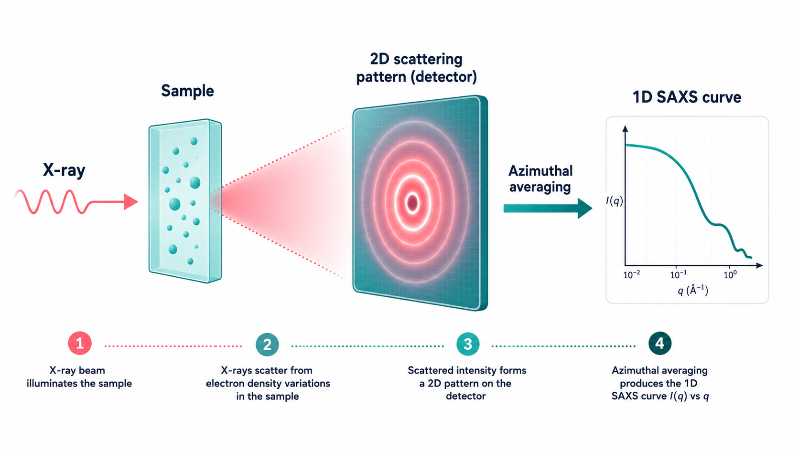
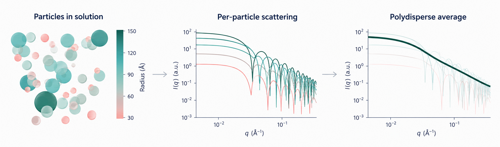
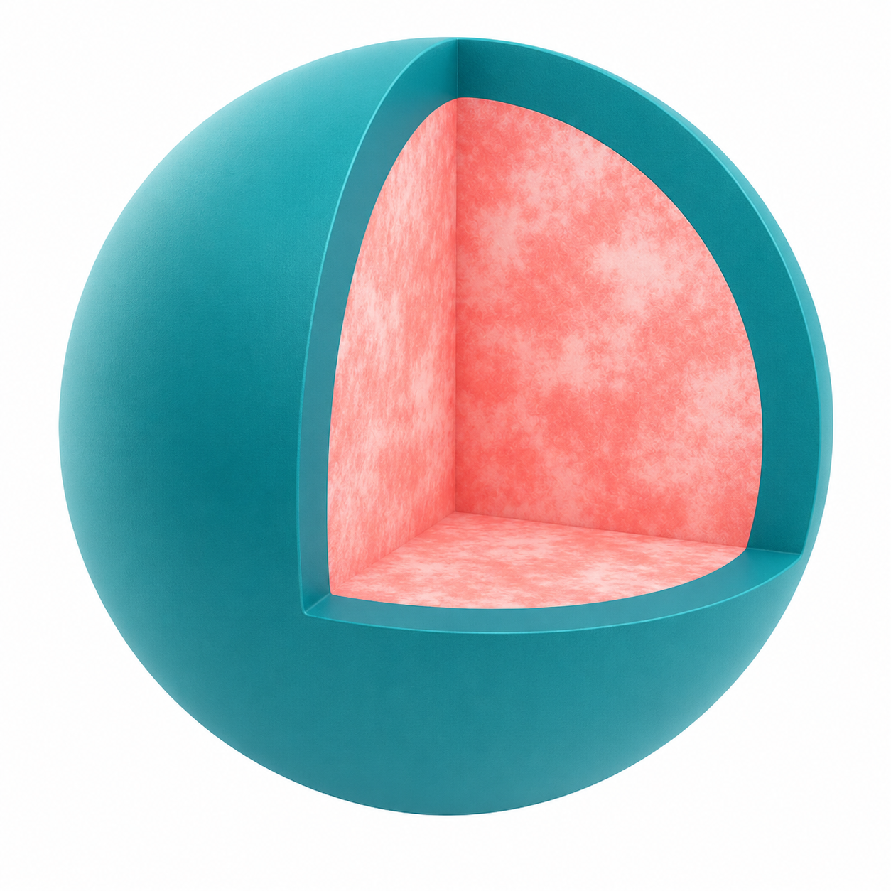
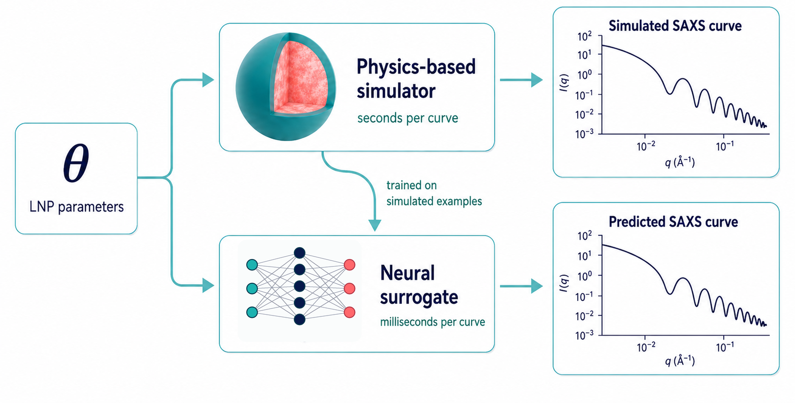

# From a SAXS curve to lipid-nanoparticle structure

A SAXS measurement of lipid nanoparticles (LNPs) gives you a
one-dimensional curve. This page walks through how that curve becomes a
structural readout of the particle population, in concepts rather than
code. General scientific background is assumed; no SAXS or
machine-learning expertise required.

The code, tutorials, and full technical reference are in the
[GitHub repository](https://github.com/mariabankestad/aisaxs).

## What does a SAXS experiment give us?

Small-angle X-ray scattering (SAXS) is a measurement performed on a
liquid sample of nanoparticles in solution, without freezing or staining
them. X-rays are scattered by electron-density variations inside the
particles. The scattered radiation forms a two-dimensional ring pattern
on the detector; averaging azimuthally around the centre collapses this
pattern into a single one-dimensional curve, scattered intensity as a
function of the wavevector *q* (a quantity related to the angle of
scattering).

  

That curve carries information about the particles in the sample.
Specifically, it encodes the spatial distribution of electron density
inside the particles, averaged over the whole population and over all
particle orientations. Bigger particles scatter differently from smaller
ones. Particles with a shell scatter differently from particles without
one. Particles with rough interiors scatter differently from particles
with uniform interiors.

There is one fundamental catch. The curve is one-dimensional. The
structure is three-dimensional. Recovering 3D structure from a 1D curve
is an underdetermined problem: more than one structure can be consistent
with the same curve.

## For uniform spherical particles, the model is analytical

The simplest case is a sample of identical, uniformly dense spherical
particles. A closed-form formula, called the **sphere form factor**,
predicts what their SAXS curve will look like given a single radius. To
analyze the measurement, you adjust the radius until the predicted curve
matches the data. Fast and clean.

## Adding polydispersity stays in the analytical regime

Real samples never contain identical particles. Even the simplest
gold-nanoparticle synthesis produces particles with a spread of sizes.
This is called **polydispersity**, and it is a property of every real
particle population.

Polydispersity is straightforward to add to the model: assume a
distribution of radii (typically log-normal), and average the sphere
form factor over that distribution. You now fit two numbers (the mean
radius and its spread) instead of one. The polydispersity integral is
fast, and the model stays analytical.

  

The smoothing is the key effect. Each individual radius produces a curve
with sharp oscillations at distinct *q* values. The size-averaged curve
inherits the shape of those individual curves at low *q* but loses the
oscillations at high *q*: the minima from different radii fall at
different *q* and fill each other in. What you measure on a real
polydisperse sample is the smooth curve, and the *spread* of the curve
(how quickly the high-*q* shape decays) carries information about the
width of the radius distribution.

This is enough for many systems: gold nanoparticles, simple silica
colloids, and any approximately spherical particle population that is
roughly uniform inside. It is what the repository's **analytical path**
provides, with both a polydisperse sphere model and a polydisperse
core-shell model. The gold tutorial walks through this on real
experimental data.

## Heterogeneous interiors break the analytical machinery

Lipid nanoparticles are different. Not because they are polydisperse
(every real population is), but because what is inside them does not
conform to any uniform density profile. They have a shell of lipids of
some thickness and composition, and an interior of stochastically
arranged lipids and cargo (often RNA). No simple closed-form formula
captures this kind of structure.

  

To analyze a SAXS measurement of these particles, you need a realistic
**numerical** forward model: a model that actually constructs a particle
(including a stochastic realization of its interior), computes its SAXS
curve from electron-density principles, and averages over both the size
distribution and the stochastic interior realizations.

This works in principle. In practice, it is far too slow. A single such
forward computation takes seconds. To fit a measurement you need to
perform thousands of these computations: each step of the optimizer asks
for one, and you run the optimizer many times from different starting
points to avoid local minima. Days of compute per fit become impractical.

## The neural surrogate

This is the first thing the framework introduces. Note what the problem
actually is. The slow numerical simulator is, on its own, already
differentiable: implemented in JAX, it produces gradients of the
predicted SAXS curve with respect to its physical inputs automatically.
That is the same machinery that makes gradient-based fitting straightforward
in the analytical case. Differentiability is not the bottleneck. **Speed
is.** A single forward evaluation takes seconds, and we need thousands
per fit.

We therefore train a neural network to mimic the simulator. The network
learns, from thousands of simulator-generated examples, how the SAXS
curve depends on the physical parameters that describe an LNP.

  

Once trained, the network is fast. Predictions take milliseconds rather
than seconds. From the optimizer's point of view it looks like the same
forward model, just thousands of times quicker, and accurate enough that
its predictions match the simulator well within the noise level of an
experimental SAXS curve. With the surrogate in place, fitting an LNP SAXS
curve becomes practical: hundreds of independent optimizations run in
under a minute on a single GPU, a task that would otherwise take days.

## What the paper covers

This overview stops at the forward problem and the surrogate. The
framework also addresses a second issue, beyond speed. SAXS is a
one-dimensional measurement of a three-dimensional structure, so many
different parameter sets can produce nearly identical curves. A single
best-fit number, taken on its own, is misleading. To make this visible,
the framework retains an ensemble of near-optimal fits and examines
which parameter directions the data constrains and which remain
degenerate. The mathematical treatment, the identifiability analysis,
and the synthetic and experimental validation are in the paper.

## Further reading

- [GitHub repository](https://github.com/mariabankestad/aisaxs) — code,
  tutorials, full technical reference.
- The paper (in preparation) for the mathematical treatment and the
  synthetic and experimental validation.
